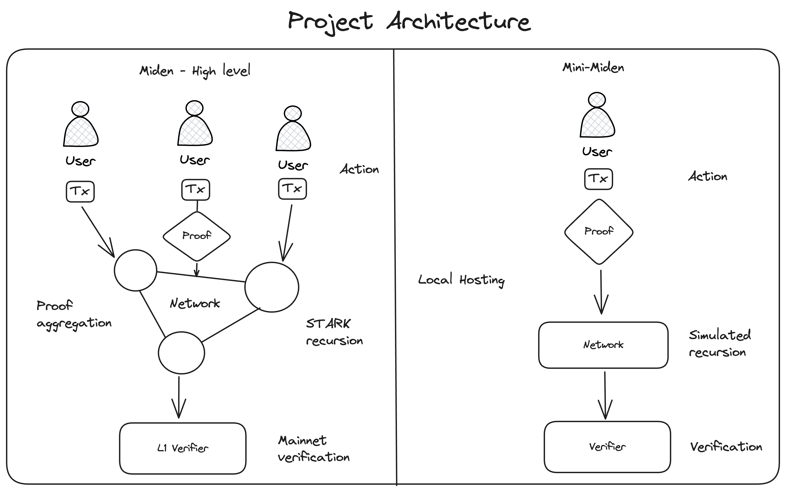

# MINI-MIDEN

MINI-MIDEN is a local implementation of the miden architecture, designed to demonstrate the basic principles of networked ZK-proof generation and verification enabling scalability and privacy.



## General Information & Disclaimer
- **Architecture**: The project is divided into three crates: User, Network, and Verifier.
- **Time**: Developed over the course of one day as a demonstration.
- **Recursion**: Recursive proving is not supported in the current Miden Prover, so the Network crate functions as a relay.

## Prerequisites
- Rust (latest stable version)
- Cargo (comes with Rust installation)

## Installation & Running 
Clone the repository and build the project:
```shell
# Get access to the code
git clone https://github.com/phklive/mini-miden.git
cd mini-miden
cargo build

# In terminal 1: Run the Verifier for proof verification
cargo run --package verifier

# In terminal 2: Run the Network for proof recursion & relaying
cargo run --package network

# In terminal 3: Run the User for transaction & proof creation
cargo run --package user
```

## Next Steps
- Implement testing suites: unit, integration, and end-to-end tests.
- Expand documentation, including in-code comments for public functions and modules.
- Refine error handling through `Result<>` and custom error types.
- Transition from println! to a structured logging framework.
- Introduce environment variables for configuration settings.
- Incorporate real transaction mechanics and recursive proving.